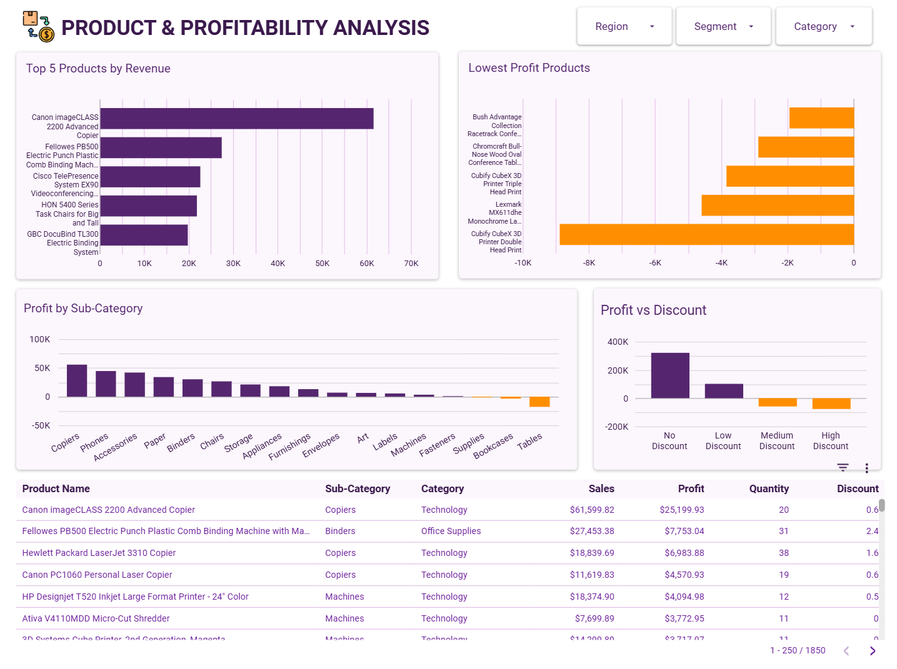

# 📊Executive Sales & Revenue Dashboard

  <b><i>Project Summary</i></b>

  
#### 💼My Work
- Validated 9,994 retail transaction records using Google Sheets.
- Assessed missing values, duplicate records, negative-profit transactions, and high-discount orders.
- Used XLOOKUP, Pivot Tables, Conditional Formatting, and spreadsheet formulas for data preparation and analysis.
- Defined business KPIs and translated business questions into measurable metrics.
- Identified key insights on regional performance, seasonality, and discount-driven profit loss.
- Built a two-page Looker Studio dashboard for executive reporting and profitability analysis.
- Developed business recommendations based on analytical findings.
  

## 🎯Business Problem

A retail company operates across multiple regions and product categories but lacks a centralized reporting system for monitoring sales performance and profitability.

Leadership needs a dashboard that answers:

- How is the business performing?
- Which regions drive revenue?
- Which categories generate profit?
- Are discounts negatively impacting profitability?
- Which products require management attention?

## ⚙️Tools Used

- Google Sheets
- Looker Studio

## 📁Dataset

[Sample Superstore Dataset](https://www.kaggle.com/datasets/keyizhang14/superstore/data)

Rows: 9,994

Columns: 21

The dataset contains retail transactions including:

- Sales
- Profit
- Quantity
- Discounts
- Product Information
- Customer Segments
- Regional Data

## 📝Data Validation

| Validation Check | Result | Action Taken |
|------------------|----------|-------------|
| Missing Postal Codes | 11 | Retained |
| Negative Profit Transactions | 1,871 | Retained for profitability analysis |
| High Discount Transactions | 856 | Retained for discount impact analysis |
| Repeated Order IDs | 4,985 | Valid transaction records; retained |
| Invalid Sales Entries | 0 | No action required |

## 📈Dashboard Overview

## 💡Key Insights
- The business is performing strongly, generating $2.3M in revenue, $286K in profit, and maintaining a 12.5% profit margin, with revenue growth observed over time.
- The West and East regions are the primary revenue drivers, while the South contributes the least.
- Technology is the top revenue-generating category, and Copiers, Phones, and Accessories are the most profitable sub-categories.
- Higher discount levels negatively impact profitability, with medium and high discounts resulting in losses.
- Several products require management attention, particularly the Cubify CubeX 3D Printer Triple Head Print and Lexmark MX611dhe Monochrome Laser Printer, which generate significant losses, while Tables and Bookcases also underperform.

## ✍🏻Recommendations

1. Review discount policies for low-margin products.
2. Investigate persistent losses in Tables and Bookcases.
3. Expand successful strategies used in the West region.
4. Increase inventory planning ahead of predictable demand spikes.

## 🧠Skills Demonstrated

#### Business Analysis
- Requirement Gathering
- KPI Definition
- Executive Reporting
- Data Storytelling

#### Spreadsheet Analytics
- Data Validation
- Pivot Analysis
- XLOOKUP Data Enrichment
- Conditional Formatting

#### Data Visualization
- Dashboard Design
- Executive Reporting
- Looker Studio

#### Analytical Thinking
- Trend Analysis
- Profitability Analysis
- Regional Performance Analysis
- Discount Impact Assessment

## 📬 Contact
If you have feedback, questions, or opportunities, feel free to connect with me:

- 🔗 LinkedIn: https://www.linkedin.com/in/jj-teston-b41950374/
- 📧 Email: johnjesterteston@gmail.com
  
⭐ I'm currently open to entry-level Data Analyst opportunities.

